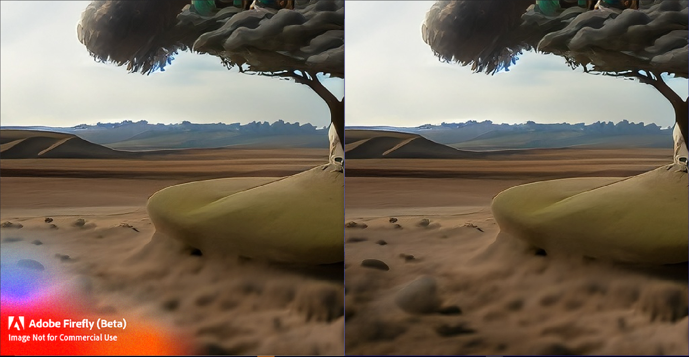

# adobefirefly-downloader

### This script **CLEARLY** breaks [Adobe's Generative AI User Guidelines](https://www.adobe.com/legal/licenses-terms/adobe-gen-ai-user-guidelines.html). Learn more about [Content Credentials here](https://www.adobe.com/go/CAI-HelpX-GenerativeAI-ContentCredentials).  🛑 You have been warned 🛑

> If you want to use the userscript, press the hyperlink below.
> # [`INSTALL USERSCRIPT`](https://github.com/xNasuni/adobefirefly-downloader/raw/main/adobefirefly-dl.user.js)
> or follow the instructions below if you want to put the scripts in the developer tools console anyway.

This can download images from adobe firefly without the watermark. Generate the images you want then open the console with CTRL + Shift + I then run [this](https://github.com/xNasuni/adobefirefly-downloader/blob/main/universal-main.js) script.

> This script downloads the images and saves the **image data** to a file called "firefly-" and then the **current unix time**, the image index with a suffix of a "@", and the file extension will be a **.jpg**  
> The userscript adds a button at the bottom left of the page that runs the script while also telling you if you are doing it correctly or not and is like a seamless integration making it so you don't have to open developer tools and into console to run the script.

### Updates
> [**`d3479da`**](https://github.com/xNasuni/adobefirefly-downloader/commit/d3479da7479507ba97d88d8112bb6d9498560dba) Now works for **Text To Image** and **Generative Recolor** - **_(6/15/2023)_** 
> [**`e4c1b2d`**](https://github.com/xNasuni/adobefirefly-downloader/commit/e4c1b2d7a3b0ea7527a58ed8bed767119bb661fc) Now works for **Text Effects** - **_(6/17/2023)_** 
> [**`e6c4b67`**](https://github.com/xNasuni/adobefirefly-downloader/commit/e6c4b67f94f440f5a33389a45ffcba50bd349992) Fixed **Generative Fill**, broke because of one word - **_(6/21/2023)_**  
> [**`1596f1d`**](https://github.com/xNasuni/adobefirefly-downloader/commit/1596f1d4c39654067a4b90b8f8577a4a33492468) Fixed **Text To Image** & Dropped support for single scripts. See [universal-main.js](https://github.com/xNasuni/adobefirefly-downloader/blob/main/universal-main.js)  - **_(9/11/2023)_** 
> [**`08bf74a`**](https://github.com/xNasuni/adobefirefly-downloader/commit/08bf74a70899529dd5aaea2caac577243382d2f3) Added userscript for more fluid integration. See [adobefirefly-dl.user.js](https://github.com/xNasuni/adobefirefly-downloader/blob/main/adobefirefly-dl.user.js) - **_(12/25/2023)_**  
> [**`0e24a00`**](https://github.com/xNasuni/adobefirefly-downloader/commit/0e24a00fa38c1f452a1b9e96cba04a12723a076f) Fixed **GetCanvas()** function not working due to a UI change in the website. See [Issue #3](https://github.com/xNasuni/adobefirefly-downloader/issues/3) for more details - **_(06/01/2024)_**  
> [**`d8b3542`**](https://github.com/xNasuni/adobefirefly-downloader/commit/d8b3542adfcaf496a3111284930719cdd5b09db9) Fixed Adobe Firefly UI from crashing for text2image. - **_(10/01/2024)_**  

## Extra Information

> intended for [adobe firefly](https://firefly.adobe.com) 
> thank you~!

### Comparison
> The left picture is the one downloaded from using the download button from adobe firefly 
> The right picture is the one downloaded with this script

